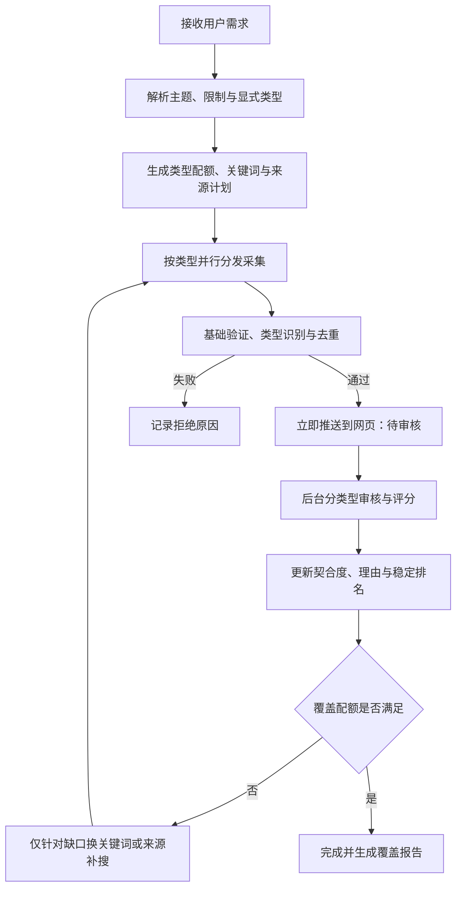

# 灵境资料工作台：通用资料搜集 Agent 完整流程

## 目标

这是一个不限定学科和主题的通用资料搜集 Agent。用户只描述需要什么，系统自动判断是限定论文、网页、图片、视频等类型，还是进行多类型综合检索。任何通过基础验证的候选应立即进入页面；模型审核、契合度计算、文件验证和补充检索在后台继续，逐步更新状态与排名。具体主题只用于测试流程，不进入固定规则、配额或来源逻辑。

用户在浏览器中直接使用。Agent 运行在现有 Render Node 服务中，不要求用户本地安装。首期任务可以保存在服务内存和浏览器项目中；需要支持关闭网页后继续运行时，再接入 PostgreSQL 检查点。

## 主流程



LangGraph 负责节点、条件分支、循环、重试和检查点；现有 `research-sources.js`、采集服务、文件发现和下载模块继续负责具体能力。Agent 不自行编造资源，也不把模型提出的网址当作已经验证的结果。

## 任务状态

```json
{
  "taskId": "research_xxx",
  "request": "<用户原始需求>",
  "topic": "<解析后的主题>",
  "constraints": { "year": 0, "language": [], "downloadable": false },
  "requestedTypes": [],
  "broadRequest": true,
  "plan": {
    "target": 24,
    "quotas": { "paper": 6, "web": 4, "image": 4, "video": 4, "dataset": 2, "report": 2, "book": 1, "other": 1 },
    "queries": {},
    "sources": {}
  },
  "coverage": {},
  "records": [],
  "attempts": [],
  "phase": "planning",
  "limits": { "rounds": 4, "requests": 50, "minutes": 5, "maximum": 60 }
}
```

`requestedTypes` 只记录用户明确点名的类型。用户只说“资料”“素材”或没有限定类型时，`broadRequest` 为 `true`，应用必须生成多类型计划，不能完全采用模型偶然返回的单一类型。

## 节点设计

### 1. intake：需求规范化

- 保留用户原始需求，提取年份、语言、可下载、开放访问等硬条件。
- 识别“只要论文”“论文和视频”等显式类型表达。
- 未指定类型时进入综合模式，默认覆盖论文、网页、图片、视频和数据；其他有可用来源的类型作为扩展。
- 模型解析失败时使用确定性规则生成计划，任务仍可继续。

### 2. planner：拆分需求

为每种类型生成独立检索词、目标数量、首选来源和备用来源。以下“黑洞”只用于说明规划器的输出形态，同一逻辑必须适用于医学、工程、历史、艺术、商业和其他主题：

| 类型 | 示例检索词 | 首选来源 |
|---|---|---|
| 论文 | `black hole astrophysics review` | Crossref、Europe PMC |
| 图片 | `black hole telescope image NASA` | Internet Archive、验证后的机构页面 |
| 视频 | `black hole lecture documentary` | Internet Archive、验证后的公开课程页 |
| 数据集 | `black hole observation dataset` | DataCite |
| 网页/报告 | `black hole overview observatory report` | DataCite、验证后的机构页面 |

类型配额按总目标动态缩放。默认情况下，任何单一类型不得在其他核心类型达到最低数量前占用超过候选池的 35%；某类型确实没有结果时可以释放剩余配额，并在最终报告中说明缺口。

### 3. dispatcher：分发采集

- 以“类型 × 来源 × 查询词”为最小任务，而不是把所有类型交给同一个来源一次返回。
- 每种核心类型至少启动一个任务；全局并发初始为 2，可按来源限流分别调整。
- 轮询调度缺口最大的类型，避免图片等高产类型持续占满结果上限。
- 每个来源保留独立页码、游标、失败次数和退避时间。

### 4. validator：验证与去重

候选进入页面前只执行快速、确定性的基础验证：

1. 标题或可识别名称不为空。
2. 来源地址为允许的公开 HTTP/HTTPS 地址，不含凭据或私网目标。
3. 资料类型与来源元数据、媒体类型或文件格式基本一致。
4. 使用 DOI、规范化 URL、来源标识和标题指纹去重。
5. 明确的错误页、占位页、缩略图、跟踪像素和无意义文件直接拒绝。

通过后立即发送 `candidate_added` 事件，记录状态为 `pending_review`。此时用户已经可以查看来源、收藏和选择；文件尚未验证时显示“查找文件”。

### 5. reviewer：后台审核

- 按资料类型分批审核，首批每批 5 条，后续可扩大到 10 条。
- 输出 `approved`、`uncertain` 或 `rejected`，以及 0–100 契合度和简短理由。
- 只有“与需求明确无关、类型明确错误、垃圾或占位内容”才能标记 `rejected`。
- 信息不足必须是 `uncertain` 并继续显示。图片缺少摘要时不能仅因文字少而拒绝；后期接入视觉模型后再检查像素内容。
- 模型未返回、超时或格式错误时保留候选，不能因审核失败隐藏结果。

### 6. ranker：渐进排名

建议的综合分数：

```text
55% 主题契合度
15% 来源可信度
10% 元数据完整度
10% 文件可获得性
10% 类型覆盖奖励
```

年份只有在用户明确提出时间要求时参与评分。页面每完成一个审核批次再更新一次排名，并使用稳定排序：分数相同时保持发现顺序。刷新排名时保留滚动位置、焦点、勾选、收藏和已打开详情，避免结果持续跳动。

### 7. coverage：覆盖检查与补搜

- 分别统计每种类型的 `approved + uncertain` 数量，不用原始抓取数量冒充有效覆盖。
- 未达到配额时，只为缺少的类型生成下一组查询词或切换备用来源。
- 同一“类型 + 来源 + 查询词”组合不会重复运行。
- 达到配额、来源耗尽、请求上限、时间上限或用户停止时结束。
- 结束时展示每种类型的目标、找到、通过、待确认和缺口，并列出失败来源。

## 网页事件协议

服务通过 SSE 或流式 NDJSON 将变化推送给网页：

| 事件 | 作用 |
|---|---|
| `task_planned` | 显示拆分后的类型、配额和来源计划 |
| `source_started` | 更新控制台当前来源与查询词 |
| `candidate_added` | 立即把基础验证通过的候选加入清单 |
| `candidate_updated` | 更新审核状态、分数、文件信息或理由 |
| `coverage_updated` | 更新每种类型的数量和缺口 |
| `source_failed` | 显示来源错误，但不终止其他来源 |
| `task_completed` | 显示最终覆盖报告和停止原因 |
| `task_cancelled` | 停止新调度并保留已经展示的结果 |

建议接口：

```text
POST /api/research/tasks                 创建任务
GET  /api/research/tasks/:id/events      接收实时事件
GET  /api/research/tasks/:id             获取任务快照
POST /api/research/tasks/:id/cancel      停止任务
```

## 安全与模型密钥

- 首期沿用用户选择的模型，不在任务记录、日志和检查点中保存 API Key。
- 服务端运行 Agent 时，模型凭据只允许通过 HTTPS 请求使用并保持在任务运行内存中，响应和日志必须脱敏；正式多用户版本应改用服务端密钥或独立的加密凭据存储。
- 抓取到的网页、标题和模型建议全部是不可信数据，只作为待验证输入，不能改变工作流规则或调用未注册工具。
- Agent 只能调用来源注册表、页面检查、模型审核和文件验证等白名单工具。

## 实施阶段

### A. 即时展示

改造现有采集回调：基础验证通过后立刻写入清单；审核改为后台更新。完成后用户不再等待全量审核才看到结果。

### B. 类型配额与补搜

将当前按来源轮询改为按类型任务调度，加入配额、来源上限、覆盖检查和缺口查询词。解决单一类型占满候选池的问题。

### C. LangGraph 服务端编排

把 intake、planner、dispatcher、validator、reviewer、ranker、coverage 和 finalize 变成 LangGraph.js 节点，使用条件边和受限循环。浏览器通过事件流接收状态，不直接承担长任务。

### D. 持久任务

接入 PostgreSQL 检查点和项目任务表；页面关闭、服务重启或网络中断后可以恢复。大文件下载继续由现有服务处理，不写入图状态。

## 通用验收矩阵

单一测试题目不能代表产品目标。至少使用以下不同意图验证同一套流程：

| 场景 | 示例需求 | 主要验证点 |
|---|---|---|
| 宽泛综合资料 | 帮我查找黑洞相关方面的资料 | 未指定类型时生成综合计划，不能只搜索网页或图片 |
| 单类型学术资料 | 查找 2022 年以后的钙钛矿太阳能电池论文 | 尊重论文和年份硬条件，不强行加入无关媒体类型 |
| 多媒体素材 | 搜集苏州园林的高清图片和公开视频 | 只规划图片与视频，正确验证媒体类型和文件地址 |
| 数据与软件 | 查找气候模型的数据集和开源代码 | 使用适合数据与软件的来源、格式和去重规则 |
| 中文与国际资料 | 查找生成式人工智能教育应用的中英文资料 | 为同一主题生成不同语言检索词并合并去重 |
| 稀缺主题或来源失败 | 查找一个资料很少的细分主题 | 如实报告缺口，不用无关内容填满配额，单个来源失败不终止任务 |

所有场景还必须共同满足：

1. 第一批通过基础验证的结果立即显示，后台审核期间仍可操作。
2. 单一高产类型不能在其他请求类型达到最低覆盖前占据超过 35% 的候选池。
3. 某类型缺少结果时自动使用该类型专用关键词或备用来源补搜，不重复已经运行的任务。
4. 元数据不足时标记待确认，不批量误删。
5. 审核完成后只更新状态和稳定排名，不重建列表或打断阅读。
6. 任一来源失败不影响其他任务；停止后已经出现的结果仍然保留。
